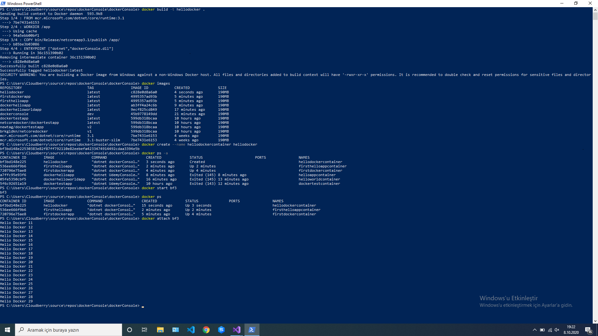

# The goal of the project

Restarting the .net core console application with docker


## What is Docker ?

Docker is an open source virtualization platform developed for software developers and system developers. With Docker, you can run Linux and Windows virtual containers (machines) on Linux, Windows and MacOSX. With this platform, you can easily install, test and deploy web systems.

## Docker advantages

- Docker starts in seconds, because each container it contains is just a process. Thus, a lightweight structure appears before us. This actually saves us from the clumsiness of virtual machines.
  
- We can run containers on the docker much more easily than a virtual machine or we can destroy them whenever we want.
  
- Resource consumption on a single server is much more efficient on docker than virtual machines. We can run more containers with less resource consumption.
  
- Docker supports different operating systems such as Windows, Linux, MacOs.
  

## Docker commands

```
docker build -t image_name .
```

Creates an image by building the dockerfile file

```
docker create --name container_name image_name
```

A container is created for the image

```
docker start container_name
```

Container is launched

```
docker stop container_name
```

The container is stopped

```
docker images
```

Docker images are listed

```
docker ps -a
```

Containers are listed

```
docker ps
```

Active containers are listed

```
docker rmi $(docker images -a -q)
```

All images are deleted

```
docker stop $(docker ps -a -q) && docker rm $(docker ps -a -q)
```

All containers are deleted

```
docker login
```

Performs docker login

```
docker tag image_name docker_Id/repo_name:tag_name
```

Tag to image

```
docker push docker_Id/repo_name:tag_name
```

The image is uploaded to the docker hub

## Dockerfile Commands

> FROM : Specifies the location where the image will be captured via dockerhub

> WORKDIR : Specifies the working directory

> COPY : Copies the files in our own directory to the working directory

> ENTRYPOINT :It refers to the path of commands to be executed.


